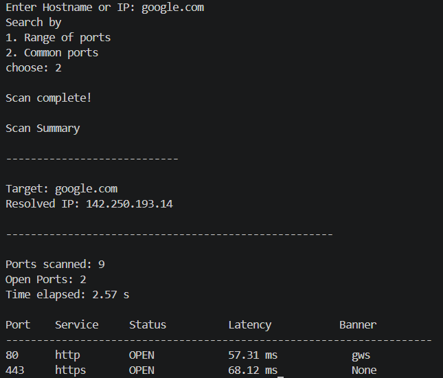

# 🛡️ CyberToolkit

CyberToolkit is a modular cybersecurity toolkit written in Python. The goal of this project is to build a collection of practical networking and cybersecurity tools while learning software engineering best practices.

This project is being developed incrementally, with each module focusing on a real-world cybersecurity task.

---

## ✨ Current Features

### Multithreaded TCP Port Scanner

- Scan a custom range of TCP ports
- Scan common ports
- Hostname to IP resolution
- Multithreaded scanning using `ThreadPoolExecutor`
- Common service identification
- Configurable timeout
- Configurable worker threads
- Custom exception handling
- Object-oriented design
- Modular project structure
- Generic TCP Banner Grabbing
- HTTP server Banner Detection
- Port Latency Measurement
- Scan Statistics

---

## 📂 Project Structure

```
CyberToolkit/
│
├── core/
│   ├── scanner.py
│   ├── services.py
│   └── exceptions.py
│
├── main.py
├── README.md
└── .gitignore
```
## 🚀 Getting Started

### Clone the repository

```bash
git clone https://github.com/Sdey555/CyberToolkit.git
cd CyberToolkit
```

### Run

```bash
python main.py
```

---

### Example Output



---

## 🛠️ Technologies Used

- Python 3
- socket
- concurrent.futures
- dataclasses
- Object-Oriented Programming (OOP)

---

## 🎯 Learning Goals

This project is helping me learn:

- Network Programming
- Python Software Engineering
- Cybersecurity Fundamentals
- Object-Oriented Design
- Multithreading
- Clean Code Practices
- Git & GitHub

---

## ⚠️ Disclaimer

CyberToolkit is developed for educational purposes and should only be used on systems you own or have explicit permission to test.

---